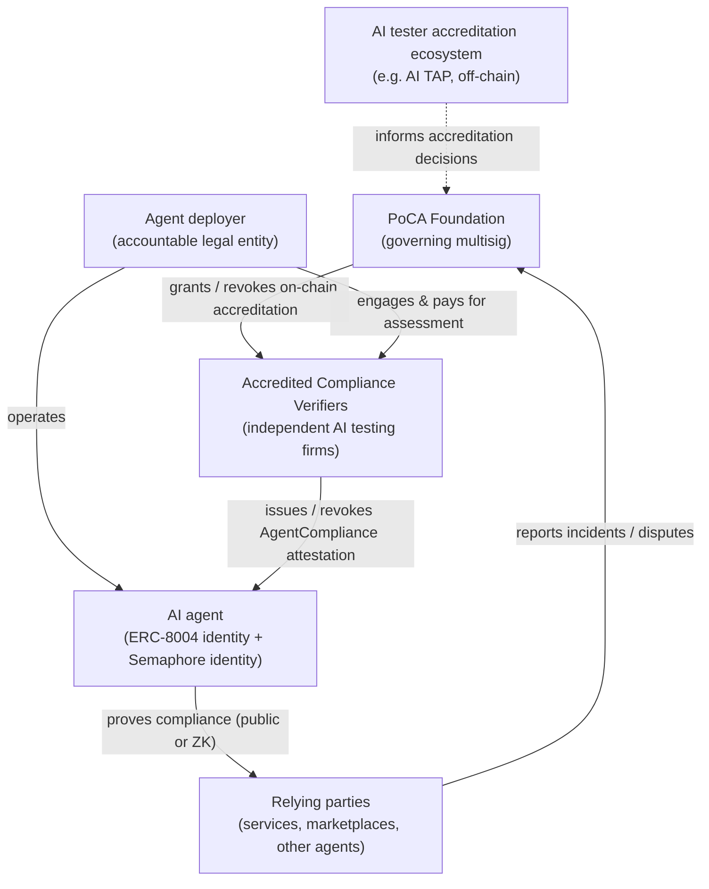
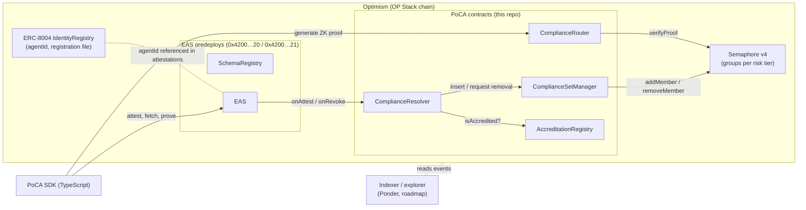

# PoCA — Proof of Compliant Agenthood

> **Independence disclaimer.** PoCA is an independent open-source project. It is not affiliated with, endorsed by, or approved by the Infocomm Media Development Authority (IMDA), the AI Verify Foundation, or the Government of Singapore. A PoCA attestation records a third party's assessment of alignment with a pinned, publicly available framework version. It is not a certification and confers no official status.

## 1. The problem: the agentic accountability gap

AI agents increasingly act with real-world consequences — calling tools, moving money, negotiating with other agents, operating on behalf of people and companies. Governance frameworks now exist for this: Singapore's IMDA published the [Model AI Governance Framework for Agentic AI](https://www.imda.gov.sg/resources/press-releases-factsheets-and-speeches/press-releases/2026/new-model-ai-governance-framework-for-agentic-ai) (Jan 2026, current v1.5), giving organisations a concrete playbook: bound the agent's risks upfront, keep humans meaningfully accountable, implement technical controls, and enable end-user responsibility.

What does **not** exist is a portable, verifiable way for an agent to carry the claim *"my deployment was independently assessed against that playbook, the assessment is current, and it can be revoked."* Today a counterparty — a marketplace, an API provider, another agent — has no better option than trusting a self-declaration on a website.

PoCA closes that gap with a decentralized registry on Optimism: **accredited third-party verifiers issue on-chain, revocable, expiring compliance attestations for AI agents, and agents can prove they hold one — either publicly or pseudonymously via a zero-knowledge membership proof.**

## 2. The idea: Worldcoin, mirrored for compliant agents

Worldcoin's World ID answers *"is this a unique human?"* without revealing which human. PoCA answers *"is this an agent whose deployment holds a valid compliance attestation?"* — optionally without revealing which agent.

| | World ID | PoCA |
|---|---|---|
| Claim proven | Unique human | Agent deployment holds a valid, unexpired, unrevoked compliance attestation of tier T |
| Credential issuer | Orb operators | Accredited compliance verifiers (independent AI testing firms; see [AI TAP anchor](02-imda-alignment.md#5-accreditation-anchor-ai-tap)) |
| Registry | WorldIDIdentityManager Merkle set (Ethereum → bridged to L2s) | [EAS](https://github.com/ethereum-attestation-service/eas-contracts) attestations + [Semaphore v4](https://github.com/semaphore-protocol/semaphore) membership sets, natively on Optimism |
| Anonymous proof | Semaphore ZK membership + nullifier | Same primitive (Semaphore v4), plus a public lookup track |
| Revocation | Absent in World ID 3.0 (a known design flaw) | First-class: EAS `revoke()` → set removal; attestations expire |
| Chain | World Chain (OP Stack, Superchain) | OP Sepolia → OP Mainnet (portable across the Superchain) |

Two deliberate differences, explained in [04-identity-and-privacy.md](04-identity-and-privacy.md):

1. **No uniqueness claim.** Worldcoin's core is sybil resistance for humans. PoCA does not claim one-agent-per-anything — one entity legitimately operates many agents. Its sybil property is narrower: one attestation backs exactly one membership identity, and nullifiers rate-limit anonymous usage per relying-party scope.
2. **Revocation is central, not optional.** Compliance is a moving target — models are updated, scaffolds change, attestations expire. Worldcoin's live design (World ID 3.0) cannot remove identities; its successor design (World ID 4.0) moved to issuer-signed credentials with native expiry. PoCA adopts that lesson from day one.

## 3. Why an on-chain registry (and why Optimism)

- **Neutral, portable trust anchor.** No single company's database decides which agents are "trusted". Attestations live on public infrastructure any counterparty can read, with anyone able to run an indexer.
- **Composable.** Smart contracts, marketplaces, [x402](https://github.com/x402-foundation/x402)-style payment facilitators, and other agents can gate on attestations programmatically.
- **Revocable and expiring by construction.** EAS carries `expirationTime` and `revoke()` natively; membership sets support removal.
- **Optimism specifically:** EAS is a **genesis predeploy on every OP Stack chain** at the same addresses (`SchemaRegistry` `0x4200…0020`, `EAS` `0x4200…0021`), so the trust anchor is portable across the whole Superchain (OP Mainnet, Base, World Chain, …) with zero redeployment; Optimism's own governance already runs on attestations (RetroPGF badgeholders, Citizens' House); and World Chain proves an OP Stack chain can be purpose-built around ZK identity gating. See [06-open-source-landscape.md](06-open-source-landscape.md).

## 4. Actors and trust relationships

Trust is layered: relying parties trust the **foundation** only to accredit competent verifiers; they trust **verifiers** to assess honestly (with accreditation revocation, an on-chain audit trail via `refUID`, and — on the roadmap — staking as recourse); they trust **the chain** for everything mechanical (validity windows, revocation state, set membership).

## 5. System components

The contracts are specified in [03-architecture.md](03-architecture.md). Everything above the chain — indexer, verifier portal, MCP/A2A bindings — is roadmap ([07-roadmap.md](07-roadmap.md)).

## 6. Dual-track verification

**Public track** — the relying party looks the agent up: resolve the agent's `agentId` (ERC-8004) or attestation UID, read the attestation from the EAS predeploy, check `revocationTime == 0` and `expirationTime > now`, inspect who attested, under which accreditation, against which framework version, with which evidence hash. Full provenance; no privacy. Right choice for marketplaces, procurement, regulators, incident response.

**Private track** — the agent proves set membership: the agent's Semaphore identity was inserted into the risk-tier group when its attestation was issued. At request time it generates a ZK proof of *"I am a member of the tier-T set"* bound to the relying party's `scope`, yielding a `nullifier` that rate-limits reuse. The relying party verifies via `ComplianceRouter` and learns **which tier, but not which agent**. Right choice for agents that shouldn't broadcast their identity to every API they touch, and for pay-per-use gating without building customer registries.

The tracks share one source of truth: the attestation. Issuance inserts into the set; revocation removes; expiry sweeps remove (phase 2). Trade-offs and the exact privacy statement are in [04-identity-and-privacy.md](04-identity-and-privacy.md); the honest gaps are in [05-threat-model.md](05-threat-model.md).

## 7. Non-goals

- **Not proof of personhood or uniqueness.** PoCA proves attested compliance, never "one agent per X".
- **Not runtime enforcement.** An attestation asserts the *assessed deployment configuration* (bound by `agentVersionHash`); it cannot stop an operator changing the agent afterwards. Detection and re-attestation, not prevention — see the threat model.
- **Not a certification body, and not IMDA.** PoCA defines rails for independent assessments referencing a public framework. It issues no official status of any kind.
- **Not a replacement for ERC-8004, A2A, MCP auth, or Web Bot Auth.** Those carry identity and transport authentication. PoCA is the assurance layer that binds to them ([06-open-source-landscape.md](06-open-source-landscape.md)).
