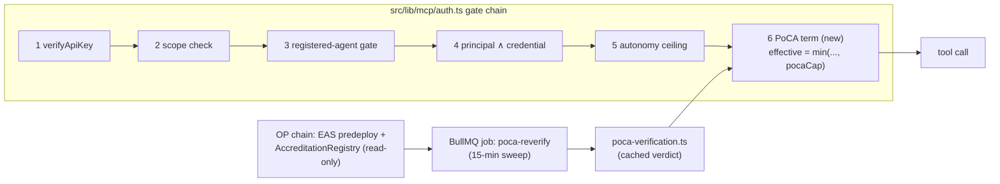

# Integration plan: PoCA × Inflect Compliance

> **Independence disclaimer.** PoCA is an independent open-source project, not affiliated with or endorsed by IMDA, the AI Verify Foundation, or the Government of Singapore. See [02-imda-alignment.md](02-imda-alignment.md).
>
> **Scope note.** This plan is based on a read-only inspection of the `inflect-compliance` codebase at **v3.80.0** (BUSL-1.1, Inflect Ltd.). File paths below refer to that repository. PoCA (MIT) can be incorporated into a BUSL-1.1 product; the reverse is not assumed anywhere in this plan.

## 1. What Inflect already has (the inspection in one page)

Inflect Compliance is a multi-tenant GRC platform whose **agent governance plane is a first-class subsystem** (~18.5k LOC in `src/lib/agentic` + `src/lib/mcp`; a 1,656-line `prisma/schema/agentic.prisma`), not a bolted-on AI feature:

| Capability | Where | Why it matters to PoCA |
|---|---|---|
| **Agent registry** — `RegisteredAgent`: autonomy level 0–6, data-access scope, reversibility, provenance, required owner, `riskTier` (NULL ⇒ deny), `modelRef` staleness, 1:1 link to an EU-AI-Act `AiSystem`, deny-by-default tool allowlist (`RegisteredAgentTool`) | `prisma/schema/agentic.prisma:555-744` | The on-platform twin of a PoCA attestation subject |
| **MCP server + token exchange** — external agents call 10 read / 4 propose tools; RFC 8693 `iflk_`→`ifxt_` scoped tokens; **all writes are propose-not-commit** | `src/app/api/mcp/route.ts`, `src/lib/mcp/token-exchange.ts`, `src/lib/mcp/tool-catalogue.ts` | The front door third-party agents actually use — the enforcement point |
| **Five-gate auth chain** — key → scope → *registered-agent gate* → *principal ∧ credential intersection* → *autonomy ceiling* `min(key, agent, tierCap)`; the codebase's stated composition law is `effective = min(independent narrowing terms)` and `agent-authority.ts:59-65` names a seam for adding a term | `src/lib/mcp/auth.ts`, `src/lib/agentic/agent-authority.ts`, `src/lib/agentic/autonomy-ceiling.ts` | PoCA verification drops in as **a third narrowing term** — the integration is a seam the architecture already reserved |
| **IMDA-derived risk scoring** — tier from autonomy × data-access × reversibility | `src/lib/agentic/agent-risk-scoring.ts` | Same conceptual axis as PoCA's `riskTier`; a mapping table, not a redesign |
| **Governance controls** — hash-chained `AuditLog`; append-only `AiDecisionLog` (EU AI Act Art 12/14); `AgentPolicyCard` pinned versions; **tool-manifest pinning** (hash of name+description+schema, vs OWASP ASI04); prompt-injection/egress guards; n-of-m approval tiering; kill switches + drills; behavioural circuit breaker; token budgets | `src/app-layer/ai/decision-log/`, `src/app-layer/ai/guard/`, implementation notes | These artifacts **are** IMDA MGF dimension-1/2/3 evidence — the raw material of a PoCA evidence bundle |
| **External receipt ingest** — Ed25519-verified *pipelock* action receipts accepted as evidence | `src/lib/mcp/receipt-verification.ts`, `POST /api/t/:slug/agent-receipts` | Existing precedent for trusting an external cryptographic attestation source |
| **Framework catalogs as data** — ships **IMDA MGF 2026**, EU AI Act, ISO/IEC 42001, OWASP Agentic Top 10, OWASP AISVS (+ cross-mappings) | `src/data/libraries/`, `prisma/fixtures/` | Verifiers can assess against Inflect's own IMDA MGF framework instance; evidence = control statuses the product already tracks |
| **Audit machinery** — `AuditPack`/`AuditorAccount`/pack shares for external auditors; integration provider framework that emits `Evidence` | `docs/integration-framework.md`, `src/app-layer/integrations/bootstrap.ts` | Ready-made rails for the verifier workflow and for attestation-driven evidence |
| **Web3 presence: none** — no viem/ethers, no DIDs/VCs; AI providers are hand-rolled `fetch`, MCP is a hand-written JSON-RPC adapter; offline/stub-first defaults | `package.json`, `src/env.ts:206-334` | Integration must respect a **zero-SDK, offline-first house style** |

## 2. Fit thesis

Inflect governs agents *inside one tenant's trust domain*; PoCA makes a third-party assessment of an agent *portable across trust domains*. They compose because both obey the same law:

**An attestation is a floor check, never an authority grant.** Inflect's architecture forbids any term from widening effective authority (`effective = min(...)`), and PoCA's threat model says the same thing from the other side (an attestation asserts assessed alignment; it must never escalate privilege). So the integration invariant, stated once and enforced everywhere:

> A PoCA attestation can **cap or maintain** an agent's effective authority in Inflect, and can make an agent *eligible* for a tenant policy that would otherwise deny it. It can never raise an autonomy level, auto-activate a DRAFT agent, or bypass registration, ownership, or tool allowlists.

Inflect then plays four PoCA roles, phased below: **relying party** (gate third-party agents on attestations), **deployer enabler** (make a tenant's own agents attestation-ready), **verifier portal** (run the accredited-verifier workflow on audit-pack rails), and **continuous-assurance source** (receipts and log anchors feeding re-attestation).

## 3. Phase A — PoCA as a narrowing term in the MCP gate chain (relying party)

The highest-value, least invasive integration: tenants that admit third-party agents through `/api/mcp` can require those agents to hold a live PoCA attestation.

**Data model** (`agentic.prisma` migration, all optional/nullable — no behaviour change until enabled):

- `RegisteredAgent`: `pocaAttestationUid Bytes?`, `pocaAgentId BigInt?` (ERC-8004), `pocaStatus` enum (`UNVERIFIED | VALID | EXPIRED | REVOKED | ATTESTER_UNACCREDITED | MISMATCH | UNREACHABLE`), `pocaTier Int?`, `pocaVerifiedAt DateTime?`, `pocaAgentVersionHash Bytes?`.
- `TenantSecuritySettings`: `pocaRequiredForThirdParty Boolean @default(false)`, `pocaFailMode` enum (`WARN | ENFORCE`, default `WARN`), `pocaMinTierByAutonomy Json?` (the tier→ceiling policy table).
- Verification verdicts are cached rows on the agent (tenant-scoped, so RLS applies as usual); chain state itself is global and unauthenticated to read.

**Verification module** — `src/lib/agentic/poca-verification.ts`, mirroring the shape of `receipt-verification.ts`:

1. Read the attestation from the EAS predeploy (`getAttestation(uid)` at `0x4200…21`), check `revocationTime == 0`, `expirationTime > now`.
2. Check the attester against PoCA's `AccreditationRegistry.isAccredited(attester)` (the registry, not the mirror attestation — it is the authoritative gate).
3. Decode the payload (flat ABI tuple — layout in [03-architecture.md §2](03-architecture.md)); confirm `identityCommitment`/`agentId` binding matches the `RegisteredAgent` record and record `riskTier` + `agentVersionHash`.
4. Emit an `AuditLog` entry for every verdict change (the house pattern: refusals are evidence too).

**Chain access, house-style:** Inflect installs no SDKs (hand-rolled Anthropic `fetch`, hand-written MCP adapter), so the recommended P0 transport is a **hand-rolled JSON-RPC `eth_call` client** (~100 lines: two fixed function selectors, static-tuple decode for `getAttestation`, bool decode for `isAccredited`) with `POCA_RPC_URL`, `POCA_CHAIN_ID` (pilot: OP Sepolia `11155420`), `POCA_ACCREDITATION_REGISTRY` in `src/env.ts` following the existing `AI_*` pattern — **default disabled/stub, fully offline**, matching the product's posture. Adopt `viem` only when Phase C's EIP-712 needs it. Parity tests can cross-check the hand-rolled decoder against `@poca/sdk`'s (`sdk/src/attestation.ts`).

**Enforcement semantics:**

- The gate never blocks on the network. It reads the cached verdict; a BullMQ job (`src/app-layer/jobs/` house pattern, ~15-min cadence — comfortably inside PoCA's revocation-latency window of pending-removal + ≤1h root history) refreshes verdicts and flips `pocaStatus`.
- `WARN` mode: verdict recorded, surfaced in the admin agent registry UI and audit log, nothing denied — the adoption on-ramp. `ENFORCE`: `pocaRequiredForThirdParty` + non-`VALID` status ⇒ deny at gate 6 with a typed refusal (same shape as the registration gate's).
- Tier mapping: PoCA `riskTier` (1–3, the *assessed envelope*) caps Inflect autonomy via the tenant's `pocaMinTierByAutonomy` policy — e.g. autonomy ≥3 requires attested tier ≥2; autonomy ≥5 requires tier 3. Defaults conservative; never widening by construction.
- `UNREACHABLE` (RPC down): keep last verdict until a staleness TTL, then degrade per `pocaFailMode` — `WARN` tenants keep running with a flagged status; `ENFORCE` tenants choose lockout semantics deliberately. Fail-open-by-default would silently disable a security control; fail-closed-by-default would let an RPC outage take down agent access. The TTL + explicit mode is the honest middle.

**Tests:** guardrail-style (`tests/guardrails/agentic-*` house pattern): gate refuses non-`VALID` under `ENFORCE`; never widens (attested tier cannot raise a ceiling); verdict transitions audited; decoder parity vs `@poca/sdk`.

## 4. Phase B — attestation-ready deployers (evidence bundles + Trust Center)

Make a tenant's *own* agents attestable by exporting exactly what a PoCA verifier needs — from artifacts Inflect already maintains:

- **Evidence bundle exporter** — `src/app-layer/reports/poca-evidence-bundle.ts` + `GET /api/t/:slug/admin/agents/:id/poca-bundle`: a content-addressed JSON manifest hashing (a) the `RegisteredAgent` snapshot (autonomy, data-access, reversibility, provenance, risk-tier scoring inputs — IMDA-derived already), (b) the pinned `AgentPolicyCard` version hash, (c) the tool allowlist + **tool-manifest pin hashes**, (d) guard configuration (`aiGuardMode`, egress/injection guards), (e) `AiDecisionLog` coverage stats and approval-tiering config, (f) kill-switch drill records, (g) the tenant's **IMDA MGF catalog control statuses** (the framework instance the product ships in `src/data/libraries/`) with linked `Evidence` digests. The manifest root becomes PoCA's `evidenceHash`; the bundle itself is shared off-chain via the existing `AuditPack` machinery.
- **`agentVersionHash`, derived not invented** — hash over (`modelRef`, policy-card version hash, tool-manifest pins, guard config). Inflect already detects `modelRef` staleness; the same signal now flags **"re-attestation required"** when the deployed configuration drifts from the attested `pocaAgentVersionHash` — closing PoCA's stale-compliance gap ([05-threat-model.md](05-threat-model.md)) with detection Inflect uniquely has.
- **Dimension mapping for verifiers**: PoCA's [dimension → schema → evidence table](02-imda-alignment.md#3-the-mapping-dimensions--attestation-schema--evidence) gains a fourth column citing Inflect's IMDA MGF catalog control IDs, so a verifier assesses against the tenant's live framework instance rather than a bespoke checklist.
- **Trust Center publication**: the public `/trust/[slug]` page lists the tenant's attested agents (attestation UID + chain + tier + validity), verifiable by anyone against the EAS predeploy — compliance posture that outsiders can check without trusting Inflect's word.

## 5. Phase C — verifier portal and continuous assurance

- **Verifier workflow on audit rails**: an `AuditorAccount` + `AuditPackShare` variant scoped to a PoCA assessment — the verifier reviews the evidence bundle in-product, records findings, and on approval Inflect builds the **EIP-712 delegated-attestation payload** (stock EAS mechanics; [03-architecture.md](03-architecture.md)) for the verifier to sign *with their own key, outside Inflect* — the platform never custodies verifier keys. This is PoCA's roadmap "verifier portal" realized inside an existing product surface. (First integration that genuinely wants `viem` for typed-data hashing.)
- **Continuous assurance from receipts**: the pipelock receipt chain (Ed25519, already ingested) and the `agentic-evidence-emission` job outputs become periodic addenda to the evidence bundle — re-attestations reference them via EAS `refUID`, turning PoCA from point-in-time toward the runtime-monitoring posture IMDA MGF dimension 3 asks for.
- **Optional ledger anchoring**: a small scheduled job attests the current `AuditLog` head hash (`entryHash` of the hash-chained ledger) under a separate EAS schema — cheap public notarization of the tenant's audit trail; independent of the agent flow, high trust yield.

## 6. Phase D — outbound ZK track and ERC-8004 (exploratory)

Inbound pseudonymous access would contradict Inflect's own `requireRegisteredAgent` philosophy (accountability-first), so the ZK track points **outward**: a tenant's attested agents carry Semaphore identities (commitments in their attestations) and prove *"tier-T attested agent"* to third-party services via PoCA's `ComplianceRouter` — without disclosing which Inflect tenant operates them. Optionally, register tenant agents in the ERC-8004 IdentityRegistry (live on Optimism) so `pocaAgentId` resolves to a public AgentCard. Both are additive and deferrable.

## 7. Phasing, effort, risks

| Phase | Contents | Rough size |
|---|---|---|
| **A** | Migration (nullable fields + settings), `poca-verification.ts` + hand-rolled `eth_call` client, gate-6 seam term, BullMQ sweep, admin UI status surface, guardrail tests | Small — days, one seam, zero new deps |
| **B** | Bundle exporter + route, `agentVersionHash` derivation + drift flag, IMDA-catalog mapping column, Trust Center section | Medium — mostly report/export plumbing over existing data |
| **C** | Verifier audit-pack variant, EIP-712 builder (`viem`), receipt addenda, optional ledger anchoring | Medium |
| **D** | Semaphore identity custody for tenant agents, outbound proof SDK use, ERC-8004 registration | Exploratory |

**Risks & invariants:**

1. **Never-widen** — enforced at the seam and asserted by guardrail tests; an attestation is eligibility + a cap, nothing more.
2. **Offline-first is preserved** — everything defaults off; the hot path reads cache only; `WARN` is the default mode; TTL + explicit `pocaFailMode` governs degradation.
3. **Revocation latency** — PoCA's two-phase removal + root-history window means on-chain revocation propagates within ~1h + keeper latency; the 15-min sweep keeps Inflect's view within that envelope, and `ENFORCE` tenants act on the public track (exact from the revoke transaction), not the ZK track.
4. **Tenancy** — verdicts are tenant-rows under RLS; only global chain reads are shared. No PII or tenant data ever goes on-chain (attestation carries hashes and addresses only).
5. **License** — PoCA is MIT → usable inside the BUSL-1.1 codebase with attribution; nothing here copies Inflect code into PoCA.
6. **`@flue/runtime` seam** — the declared-but-unreachable external agent driver (`agent-driver.ts:135-138`) is exactly the class of third-party runtime Phase A is built to gate when it goes live.

## 8. Ten-step implementation roadmap

Each step is sized for one focused working session (human or coding agent) and ships independently. **Prompt** blocks are ready to hand to an implementation agent verbatim; they assume both repositories are checked out (`hello-world` = PoCA, `inflect-compliance` read-write) and that the [never-widen invariant (§2)](#2-fit-thesis) is restated in every session. Steps 2–8 add **zero new dependencies** to Inflect; `viem` enters only at step 9. Repo tags: `[poca]` = this repo, `[inflect]` = inflect-compliance.

---

### Step 1 — Deploy PoCA to OP Sepolia and prove the loop on-chain `[poca]`

**Goal.** A live registry to integrate against: contracts deployed, schemas registered on the predeploy, one accredited test verifier, one live attestation.

**Context.** `contracts/script/Deploy.s.sol`, [03-architecture.md §5](03-architecture.md); OP Sepolia chain id `11155420`, predeploys `0x4200…20`/`0x4200…21` (fixed); a faucet-funded throwaway EOA.

**Prompt.**
> In the PoCA repo, deploy the PoC to OP Sepolia: `forge script contracts/script/Deploy.s.sol --rpc-url $OP_SEPOLIA_RPC --private-key $PK --broadcast`. Then, via `cast`: grant an accreditation to a second test address on `AccreditationRegistry` (12-month expiry), issue one `AgentCompliance` attestation from it (30-day expiry, dummy commitment), and confirm `ComplianceSetManager.commitmentOf(uid)` matches. Create `docs/09-deployments.md` recording: chain, commit hash deployed, all contract addresses, both schema UIDs, and the exact `cast` commands used. Do not commit any keys.

**Tests.** `cast call` shows the AgentCompliance schema registered with the resolver attached; attest → `MemberAdded` + `commitmentOf(uid)` correct; attest from an unaccredited address reverts; `revoke` flips `removalPending`.

**Hardening.** Throwaway deployer funded minimally; verify contract source on the OP Sepolia explorer; record the deployed commit hash so bytecode is reproducible; note the ownership-transfer plan (multisig, phase 3) in the deployments doc.

---

### Step 2 — Inflect data model + config plumbing (no behaviour change) `[inflect]`

**Goal.** Schema and env surface exist, everything defaults off.

**Context.** `prisma/schema/agentic.prisma:555-744` (`RegisteredAgent`), `src/env.ts:206-334` (the stub-first `AI_*` pattern to copy), `prisma/rls-setup.sql`, `security/audit-allowlist.json` + its coverage guardrail tests.

**Prompt.**
> Add to `RegisteredAgent`: `pocaAttestationUid Bytes?`, `pocaAgentId BigInt?`, `pocaStatus` enum (`UNVERIFIED|VALID|EXPIRED|REVOKED|ATTESTER_UNACCREDITED|MISMATCH|UNREACHABLE`, default `UNVERIFIED`), `pocaTier Int?`, `pocaVerifiedAt DateTime?`, `pocaAgentVersionHash Bytes?`. Add to `TenantSecuritySettings`: `pocaRequiredForThirdParty Boolean @default(false)`, `pocaFailMode` enum (`WARN|ENFORCE`, default `WARN`), `pocaMinTierByAutonomy Json?`, `pocaVerdictTtlMinutes Int @default(60)`. Add `POCA_ENABLED` (default false), `POCA_RPC_URL`, `POCA_CHAIN_ID`, `POCA_EAS_ADDRESS`, `POCA_ACCREDITATION_REGISTRY`, `POCA_ROUTER` to `src/env.ts` following the `AI_*` stub-first pattern. Write the migration, extend the audit allowlist for the new fields, and change no runtime behaviour anywhere.

**Tests.** Migration applies/rolls back cleanly; audit-allowlist coverage guardrail green; fresh settings row ⇒ disabled + `WARN`; existing RLS guardrail tests unchanged.

**Hardening.** DB `CHECK (pocaTier IN (1,2,3))`; enums not strings; no default RPC URL baked in; new fields excluded from all public/portal serializers (add a denylist test now, before any UI exists).

---

### Step 3 — Zero-dependency chain client `[inflect]`

**Goal.** Read the chain the way the house reads everything: hand-rolled `fetch`, strictly validated.

**Context.** PoCA payload layout ([03-architecture.md §2](03-architecture.md)) and reference decoder `hello-world/sdk/src/attestation.ts` + `constants.ts`; style precedent `src/lib/mcp/receipt-verification.ts`.

**Prompt.**
> Implement `src/lib/poca/chain-client.ts` with no new dependencies: JSON-RPC `eth_call` over `fetch` to `POCA_RPC_URL`. Export `getAttestation(uid)` (EAS at `POCA_EAS_ADDRESS`, function `getAttestation(bytes32)`, decode the attestation tuple including dynamic `bytes data`) and `isAccredited(address)` (against `POCA_ACCREDITATION_REGISTRY`). On first use verify `eth_chainId == POCA_CHAIN_ID`. 5s timeout, one jittered retry, 128 KiB response cap, strict `0x`-hex validation, typed errors — never throw raw. Generate golden-vector fixtures for the decoder using `@poca/sdk` from the PoCA repo (script under `scripts/`, fixtures committed as JSON) and test parity against them.

**Tests.** Decode parity on golden vectors (valid / revoked / expired / zero-uid / same-payload-reencoded); malformed hex → typed error; timeout and chain-id mismatch paths; no fixture drift (regeneration is deterministic).

**Hardening.** RPC URL comes from env only — never from tenant input; redact the URL in logs and errors; oversized/streaming responses rejected; all failures map to an `UNREACHABLE`-class result, never an exception escaping to callers.

---

### Step 4 — Verification service and verdict state machine `[inflect]`

**Goal.** One place that turns chain state + agent binding into a cached, audited verdict.

**Context.** Step 3 client; `src/lib/db-context.ts` (`withTenantDb`), the Prisma audit middleware + allowlist, verdict semantics in §3 of this doc.

**Prompt.**
> Implement `src/lib/agentic/poca-verification.ts`: `computeVerdict(agent)` → `{status, tier, attestationAgentVersionHash}` where status is `VALID` only if the attestation exists, `revocationTime == 0`, `expirationTime > now` (±5 min skew tolerance), the attester passes `isAccredited`, and the payload's `agentId`/`identityCommitment` binding matches the `RegisteredAgent` (binding mismatch ⇒ `MISMATCH`). Chain unreachable ⇒ keep the previous verdict, mark staleness. `persistVerdict` writes transitions on the agent row inside `withTenantDb` and emits an `AuditLog` entry on every status **change** (refusals are evidence — house rule); identical re-verdicts update `pocaVerifiedAt` only.

**Tests.** Table-driven verdict matrix over all six statuses; transition idempotence (no duplicate audit rows); expiry skew boundaries; RLS respected (cross-tenant agent invisible).

**Hardening.** Persist only the fields needed (no raw payload retention); per-agent verify rate-limit; nothing tenant-controlled ever reaches the RPC layer; verdict writes are the only mutation this module performs.

---

### Step 5 — Gate 6: the narrowing term `[inflect]`

**Goal.** The seam the architecture reserved, filled — enforcement without a single network call in the hot path.

**Context.** `src/lib/mcp/auth.ts` (gate-chain header doc), `src/lib/agentic/agent-authority.ts` (the seam at :59-65), `autonomy-ceiling.ts`, refusal shape in `agent-registration-gate.ts`, `tests/guards/mcp-tools-use-shared-authz.test.ts`.

**Prompt.**
> Add the PoCA term at the documented seam in `agent-authority.ts`: applies only when `POCA_ENABLED`, `pocaRequiredForThirdParty`, and `agent.provenance == THIRD_PARTY`. Read the **cached** verdict only. `ENFORCE` + status ≠ `VALID` (or verdict older than `pocaVerdictTtlMinutes`) ⇒ typed refusal (`POCA_ATTESTATION_INVALID`, mirroring the registration gate's refusal shape, audited). `VALID` ⇒ effective ceiling = `min(existing, ceilingFor(pocaTier, tenant.pocaMinTierByAutonomy))`. `WARN` ⇒ annotate the auth context and audit, never deny. Kill switches and gates 1–5 keep precedence; no code path outside this term may consult PoCA state. State in a comment and enforce in tests: this term can only lower or equal the effective authority.

**Tests.** Refusal matrix (6 statuses × WARN/ENFORCE × provenance); **property test: for all inputs, `effective_with_poca ≤ effective_without_poca`**; every pre-existing gate test unchanged; stale-verdict TTL behaviour per mode.

**Hardening.** Hot path pure and synchronous over cached rows; the opt-in default (`false`) is a deliberate, documented divergence from the registration gate's enforce-by-default (that gate protects a closed tenant; this one adds an external dependency); stable typed error codes for API consumers; every `ENFORCE` denial audited with the verdict that caused it.

---

### Step 6 — Re-verify sweep + admin surface `[inflect]`

**Goal.** Verdicts stay fresh without anyone watching; admins can bind, see, and force-check attestations.

**Context.** Jobs house pattern (`src/app-layer/jobs/queue.ts`, `scheduler.ts`, `register-schedules.ts`; `agent-run-reaper.ts` as a template), admin registry surface (`/api/t/:slug/admin/agents/*`, `docs/implementation-notes/2026-09-04-agent-registry-surface.md`), OTel/pino conventions.

**Prompt.**
> Add `src/app-layer/jobs/poca-reverify.ts` on a 15-minute schedule: iterate tenants with PoCA-bound agents, set tenant context per batch, recompute verdicts via step 4, jitter start, concurrency 1 per tenant. Circuit-break the whole sweep after N consecutive RPC failures (skip cycle, warn log + OTel counter). Extend the admin agents API/UI: set/clear `pocaAttestationUid`/`pocaAgentId` (OWNER/ADMIN only, audited), display status/tier/verifiedAt/staleness, and a rate-limited "Re-verify now" action.

**Tests.** Schedule registered; batches respect RLS; circuit-breaker trips and recovers; endpoint authz matrix; transition during sweep produces exactly one audit row; UI state rendering for all six statuses.

**Hardening.** Global + per-tenant RPC budget per sweep; jitter so multi-instance deployments don't stampede; metrics for verdict distribution, sweep duration, RPC error rate; alert hook on any transition **into** `REVOKED` (that's an incident signal, not housekeeping).

---

### Step 7 — Evidence bundle, derived `agentVersionHash`, drift detection `[inflect]`

**Goal.** One export makes a tenant agent attestation-ready; configuration drift after attestation is caught automatically.

**Context.** Tool-manifest pinning note (`docs/implementation-notes/2026-09-05-mcp-tool-manifest-pinning.md`), `AgentPolicyCard` versions, `src/app-layer/ai/decision-log/`, IMDA MGF catalog under `src/data/libraries/`, reports house patterns, PoCA mapping table ([02-imda-alignment.md §3](02-imda-alignment.md)).

**Prompt.**
> Implement `src/app-layer/reports/poca-evidence-bundle.ts` + `GET /api/t/:slug/admin/agents/:id/poca-bundle`: a canonical-JSON manifest (sorted keys, stable number formatting — RFC 8785 style) covering the registration snapshot (autonomy, data-access, reversibility, provenance, risk-tier inputs), pinned policy-card version hash, tool allowlist with manifest pin hashes, guard configuration, decision-log coverage stats, kill-switch drill records, and IMDA MGF catalog control statuses with linked Evidence digests. `manifestRoot` = SHA-256 of the canonical bytes. Implement `deriveAgentVersionHash(agent)` = SHA-256 over (modelRef, policy-card version hash, sorted tool pins, guard config). Nightly job: derived hash ≠ `pocaAgentVersionHash` ⇒ verdict `MISMATCH` + "Re-attestation required" flag on the admin surface.

**Tests.** Determinism (two exports byte-identical); golden manifest snapshot; drift flag flips on a policy-card bump and clears after re-attestation; route requires admin + entitlement; denylist test proves no PII/secrets/evidence-contents in the bundle (digests only).

**Hardening.** Size cap with streaming assembly; export itself audit-logged; bundle distribution only via the existing `AuditPack` share machinery — no standalone public URL; embed the generator version in the manifest for reproducibility.

---

### Step 8 — Trust Center publication `[inflect]`

**Goal.** Attested agents become publicly verifiable posture — checkable by anyone against the chain, not against Inflect's word.

**Context.** Trust Center routes (`/trust/[slug]`), its caching pattern, step 4's verdict cache, PoCA wording rules ([02-imda-alignment.md §7](02-imda-alignment.md)).

**Prompt.**
> Add an "Attested AI agents" section to the public Trust Center: per-agent opt-in boolean (new field, default off, admin-set, audited); render only agents whose cached status is `VALID`; show name, PoCA tier, attestation UID with chain + explorer link, validity window, and a "verify it yourself" snippet (explorer link + one `cast call`). Revalidate from cache on a ≤15-minute ISR/SSR cycle; never enumerate non-opted or non-attested agents; reuse the standard PoCA non-endorsement disclaimer line; never use the word "certified".

**Tests.** Opt-in-only rendering; revoked agent disappears within one sweep + revalidation; zero cross-tenant leakage (guardrail); cache headers correct; snapshot of the public HTML contains no internal identifiers.

**Hardening.** Public path reads cache only — an RPC outage cannot slow or break the page; page rate-limited like other public portals; copy reviewed against the §7 wording rules.

---

### Step 9 — Verifier portal + EIP-712 delegated attestation `[inflect + poca]`

**Goal.** An accredited verifier runs the whole assessment inside Inflect and signs the attestation with their own key; Inflect never custodies verifier keys.

**Context.** `AuditPack`/`AuditorAccount`/`AuditPackShare` models, PoCA delegated-attestation mechanics ([03-architecture.md](03-architecture.md)), eas-contracts EIP-712 typed data (parity source: `@ethereum-attestation-service/eas-sdk`), `src/lib/entitlements.ts`.

**Prompt.**
> Build the verifier flow on audit rails: a `POCA_ASSESSMENT` audit-pack share type granting an `AuditorAccount` read access to a **pinned** evidence bundle (by manifestRoot); an assessment form recording per-dimension outcomes (→ `dimensionsBitmap`) and tier; on approval, build the EAS delegated-attestation EIP-712 typed data for the `AgentCompliance` schema (recipient, expiry, refUID to the prior attestation, deadline ≤ 1 h, attester = the verifier's address) and return it for wallet signing client-side. A submit endpoint accepts the signature, pre-checks the verifier against `AccreditationRegistry.isAccredited`, and relays via `attestByDelegation` from a minimal relayer key (gas only). This step introduces `viem` (typed-data hashing + relaying) — keep it confined to `src/lib/poca/`. Gate the feature ENTERPRISE.

**Tests.** Typed-data hash golden-vector parity vs eas-sdk; expired deadline rejected; signature from a non-accredited or mismatched address rejected before relay; portal ACL matrix (auditor sees only the pinned bundle); full Sepolia round-trip integration test (assessment → signature → on-chain UID → step 4 verdict flips `VALID`).

**Hardening.** The hash shown to the signer is provably the hash submitted (immutable payload preview, stored + compared); short deadlines; relayer key isolated, minimally funded, spend-alerted; the assessment → attestation-UID link is written to the audit ledger; verifier onboarding checks accreditation on-chain, not by assertion.

---

### Step 10 — Continuous assurance + outbound ZK pilot `[inflect + poca]`

**Goal.** Close the loop: re-attestation fed by runtime evidence, one agent proving its tier pseudonymously to the outside world, and an incident drill that proves revocation actually bites.

**Context.** `src/lib/security/tenant-keys.ts` (per-tenant DEK envelope encryption), `receipt-verification.ts`, PoCA `sdk/src/proof.ts` + [04-identity-and-privacy.md](04-identity-and-privacy.md), the step-1 deployment (router address); note: exercising ZK-side removal needs someone to run PoCA's `finalizeRemoval` (manual `cast` or a 50-line watcher script — PoCA roadmap's keeper).

**Prompt.**
> Three parts. (a) Re-attestation flow: next bundle embeds pipelock receipt-chain digests and decision-log coverage deltas; the new attestation's `refUID` chains to the prior UID. (b) Optional notarization job: attest the current `AuditLog` head `entryHash` under a separate EAS schema on a daily schedule (tenant opt-in). (c) ZK pilot for ONE internal agent: generate a Semaphore identity in the worker, envelope-encrypt the secret with the tenant DEK via `tenant-keys.ts` (never env, never logs), include its commitment in the next re-attestation, and prove "tier-T member" against the deployed `ComplianceRouter` on Sepolia from a worker script using `@poca/sdk`. Write `docs/poca-runbook.md` covering: key rotation (revoke → re-attest with fresh commitment), and the incident drill: revoke on-chain → sweep flips `REVOKED` → `ENFORCE` tenant denies at gate 6, with measured detection latency and a quarterly drill schedule (mirror the kill-switch drill pattern).

**Tests.** End-to-end drill on Sepolia with latency measured (target: denial within one sweep period + margin); refUID chain integrity across two re-attestations; DEK round-trip for the identity secret; ZK proof verifies on the router and fails after removal is finalized; notarization attestations reference monotonically-advancing ledger heads.

**Hardening.** Identity secret handled like an integration credential (encrypted at rest, redacted everywhere); rotation runbook tested, not just written; monitor the PoCA-side `RemovalRequired` backlog during the pilot; restate in the runbook that inbound pseudonymous access remains out of scope (accountability-first, per §6).

---

## 9. Verification plan (end-to-end)

1. **Unit/guardrail**: decoder parity vs `@poca/sdk`; gate-6 refusal matrix (`VALID/EXPIRED/REVOKED/MISMATCH/UNREACHABLE` × `WARN/ENFORCE`); never-widen assertions; audit-log coverage of verdict transitions — all runnable offline against a stubbed RPC (house style).
2. **Testnet loop (OP Sepolia)**: deploy the PoCA PoC (`contracts/script/Deploy.s.sol` in this repo — predeploys are already live there); accredit a test verifier; register an agent in a dev Inflect tenant → export its bundle → attest with the bundle's `evidenceHash` + derived `agentVersionHash` → sweep verifies `VALID` and the gate admits at the mapped ceiling → `revoke()` on EAS → next sweep flips `REVOKED` → `ENFORCE` tenant denies at gate 6.
3. **Drift test**: bump the agent's policy card or tool manifest → `agentVersionHash` mismatch → status `MISMATCH` + "re-attestation required" flag while the attestation itself is still live — proving the stale-compliance detection works.

## Appendix — field mapping

| PoCA `AgentCompliance` field | Inflect source |
|---|---|
| `agentId` (ERC-8004) | `RegisteredAgent.pocaAgentId` (optional; 0 if unregistered) |
| `deployer` | Tenant setting: organization wallet address (new, admin-set) |
| `frameworkVersion` | `"IMDA-MGF-AgenticAI-v1.5"` pin; cross-checked against the tenant's IMDA MGF catalog version |
| `dimensionsBitmap` | Verifier's assessment outcome over the mapped catalog controls |
| `riskTier` | Mapped from Inflect's IMDA-derived tier (`agent-risk-scoring.ts`) via the policy table |
| `agentVersionHash` | hash(`modelRef`, policy-card version hash, tool-manifest pins, guard config) |
| `evidenceHash` | Root of the Phase-B bundle manifest |
| `identityCommitment` | Phase D: Semaphore identity held by the agent runtime; 0/unused before that |
