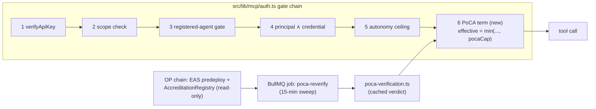

# Integration plan: PoCA × Inflect Compliance

> **Independence disclaimer.** PoCA is an independent open-source project, not affiliated with or endorsed by IMDA, the AI Verify Foundation, or the Government of Singapore. See [02-imda-alignment.md](02-imda-alignment.md).
>
> **Scope note.** This plan is based on a read-only inspection of the `inflect-compliance` codebase at **v3.80.0** (BUSL-1.1, Inflect Ltd.). File paths below refer to that repository. PoCA (MIT) can be incorporated into a BUSL-1.1 product; the reverse is not assumed anywhere in this plan.

## 1. What Inflect already has (the inspection in one page)

Inflect Compliance is a multi-tenant GRC platform whose **agent governance plane is a first-class subsystem** (~18.5k LOC in `src/lib/agentic` + `src/lib/mcp`; a 1,656-line `prisma/schema/agentic.prisma`), not a bolted-on AI feature:

| Capability | Where | Why it matters to PoCA |
|---|---|---|
| **Agent registry** — `RegisteredAgent`: autonomy level 0–6, data-access scope, reversibility, provenance, required owner, `riskTier` (NULL ⇒ deny), `modelRef` staleness, 1:1 link to an EU-AI-Act `AiSystem`, deny-by-default tool allowlist (`RegisteredAgentTool`) | `prisma/schema/agentic.prisma:555-744` | The on-platform twin of a PoCA attestation subject |
| **MCP server + token exchange** — external agents call 10 read / 4 propose tools; RFC 8693 `iflk_`→`ifxt_` scoped tokens; **all writes are propose-not-commit** | `src/app/api/mcp/route.ts`, `src/lib/mcp/token-exchange.ts`, `src/lib/mcp/tool-catalogue.ts` | The front door third-party agents actually use — the enforcement point |
| **Five-gate auth chain** — key → scope → *registered-agent gate* → *principal ∧ credential intersection* → *autonomy ceiling* `min(key, agent, tierCap)`; the codebase's stated composition law is `effective = min(independent narrowing terms)` and `agent-authority.ts:59-65` names a seam for adding a term | `src/lib/mcp/auth.ts`, `src/lib/agentic/agent-authority.ts`, `src/lib/agentic/autonomy-ceiling.ts` | PoCA verification drops in as **a third narrowing term** — the integration is a seam the architecture already reserved |
| **IMDA-derived risk scoring** — tier from autonomy × data-access × reversibility | `src/lib/agentic/agent-risk-scoring.ts` | Same conceptual axis as PoCA's `riskTier`; a mapping table, not a redesign |
| **Governance controls** — hash-chained `AuditLog`; append-only `AiDecisionLog` (EU AI Act Art 12/14); `AgentPolicyCard` pinned versions; **tool-manifest pinning** (hash of name+description+schema, vs OWASP ASI04); prompt-injection/egress guards; n-of-m approval tiering; kill switches + drills; behavioural circuit breaker; token budgets | `src/app-layer/ai/decision-log/`, `src/app-layer/ai/guard/`, implementation notes | These artifacts **are** IMDA MGF dimension-1/2/3 evidence — the raw material of a PoCA evidence bundle |
| **External receipt ingest** — Ed25519-verified *pipelock* action receipts accepted as evidence | `src/lib/mcp/receipt-verification.ts`, `POST /api/t/:slug/agent-receipts` | Existing precedent for trusting an external cryptographic attestation source |
| **Framework catalogs as data** — ships **IMDA MGF 2026**, EU AI Act, ISO/IEC 42001, OWASP Agentic Top 10, OWASP AISVS (+ cross-mappings) | `src/data/libraries/`, `prisma/fixtures/` | Verifiers can assess against Inflect's own IMDA MGF framework instance; evidence = control statuses the product already tracks |
| **Audit machinery** — `AuditPack`/`AuditorAccount`/pack shares for external auditors; integration provider framework that emits `Evidence` | `docs/integration-framework.md`, `src/app-layer/integrations/bootstrap.ts` | Ready-made rails for the verifier workflow and for attestation-driven evidence |
| **Web3 presence: none** — no viem/ethers, no DIDs/VCs; AI providers are hand-rolled `fetch`, MCP is a hand-written JSON-RPC adapter; offline/stub-first defaults | `package.json`, `src/env.ts:206-334` | Integration must respect a **zero-SDK, offline-first house style** |

## 2. Fit thesis

Inflect governs agents *inside one tenant's trust domain*; PoCA makes a third-party assessment of an agent *portable across trust domains*. They compose because both obey the same law:

**An attestation is a floor check, never an authority grant.** Inflect's architecture forbids any term from widening effective authority (`effective = min(...)`), and PoCA's threat model says the same thing from the other side (an attestation asserts assessed alignment; it must never escalate privilege). So the integration invariant, stated once and enforced everywhere:

> A PoCA attestation can **cap or maintain** an agent's effective authority in Inflect, and can make an agent *eligible* for a tenant policy that would otherwise deny it. It can never raise an autonomy level, auto-activate a DRAFT agent, or bypass registration, ownership, or tool allowlists.

Inflect then plays four PoCA roles, phased below: **relying party** (gate third-party agents on attestations), **deployer enabler** (make a tenant's own agents attestation-ready), **verifier portal** (run the accredited-verifier workflow on audit-pack rails), and **continuous-assurance source** (receipts and log anchors feeding re-attestation).

## 3. Phase A — PoCA as a narrowing term in the MCP gate chain (relying party)

The highest-value, least invasive integration: tenants that admit third-party agents through `/api/mcp` can require those agents to hold a live PoCA attestation.

**Data model** (`agentic.prisma` migration, all optional/nullable — no behaviour change until enabled):

- `RegisteredAgent`: `pocaAttestationUid Bytes?`, `pocaAgentId BigInt?` (ERC-8004), `pocaStatus` enum (`UNVERIFIED | VALID | EXPIRED | REVOKED | ATTESTER_UNACCREDITED | MISMATCH | UNREACHABLE`), `pocaTier Int?`, `pocaVerifiedAt DateTime?`, `pocaAgentVersionHash Bytes?`.
- `TenantSecuritySettings`: `pocaRequiredForThirdParty Boolean @default(false)`, `pocaFailMode` enum (`WARN | ENFORCE`, default `WARN`), `pocaMinTierByAutonomy Json?` (the tier→ceiling policy table).
- Verification verdicts are cached rows on the agent (tenant-scoped, so RLS applies as usual); chain state itself is global and unauthenticated to read.

**Verification module** — `src/lib/agentic/poca-verification.ts`, mirroring the shape of `receipt-verification.ts`:

1. Read the attestation from the EAS predeploy (`getAttestation(uid)` at `0x4200…21`), check `revocationTime == 0`, `expirationTime > now`.
2. Check the attester against PoCA's `AccreditationRegistry.isAccredited(attester)` (the registry, not the mirror attestation — it is the authoritative gate).
3. Decode the payload (flat ABI tuple — layout in [03-architecture.md §2](03-architecture.md)); confirm `identityCommitment`/`agentId` binding matches the `RegisteredAgent` record and record `riskTier` + `agentVersionHash`.
4. Emit an `AuditLog` entry for every verdict change (the house pattern: refusals are evidence too).

**Chain access, house-style:** Inflect installs no SDKs (hand-rolled Anthropic `fetch`, hand-written MCP adapter), so the recommended P0 transport is a **hand-rolled JSON-RPC `eth_call` client** (~100 lines: two fixed function selectors, static-tuple decode for `getAttestation`, bool decode for `isAccredited`) with `POCA_RPC_URL`, `POCA_CHAIN_ID` (pilot: OP Sepolia `11155420`), `POCA_ACCREDITATION_REGISTRY` in `src/env.ts` following the existing `AI_*` pattern — **default disabled/stub, fully offline**, matching the product's posture. Adopt `viem` only when Phase C's EIP-712 needs it. Parity tests can cross-check the hand-rolled decoder against `@poca/sdk`'s (`sdk/src/attestation.ts`).

**Enforcement semantics:**

- The gate never blocks on the network. It reads the cached verdict; a BullMQ job (`src/app-layer/jobs/` house pattern, ~15-min cadence — comfortably inside PoCA's revocation-latency window of pending-removal + ≤1h root history) refreshes verdicts and flips `pocaStatus`.
- `WARN` mode: verdict recorded, surfaced in the admin agent registry UI and audit log, nothing denied — the adoption on-ramp. `ENFORCE`: `pocaRequiredForThirdParty` + non-`VALID` status ⇒ deny at gate 6 with a typed refusal (same shape as the registration gate's).
- Tier mapping: PoCA `riskTier` (1–3, the *assessed envelope*) caps Inflect autonomy via the tenant's `pocaMinTierByAutonomy` policy — e.g. autonomy ≥3 requires attested tier ≥2; autonomy ≥5 requires tier 3. Defaults conservative; never widening by construction.
- `UNREACHABLE` (RPC down): keep last verdict until a staleness TTL, then degrade per `pocaFailMode` — `WARN` tenants keep running with a flagged status; `ENFORCE` tenants choose lockout semantics deliberately. Fail-open-by-default would silently disable a security control; fail-closed-by-default would let an RPC outage take down agent access. The TTL + explicit mode is the honest middle.

**Tests:** guardrail-style (`tests/guardrails/agentic-*` house pattern): gate refuses non-`VALID` under `ENFORCE`; never widens (attested tier cannot raise a ceiling); verdict transitions audited; decoder parity vs `@poca/sdk`.

## 4. Phase B — attestation-ready deployers (evidence bundles + Trust Center)

Make a tenant's *own* agents attestable by exporting exactly what a PoCA verifier needs — from artifacts Inflect already maintains:

- **Evidence bundle exporter** — `src/app-layer/reports/poca-evidence-bundle.ts` + `GET /api/t/:slug/admin/agents/:id/poca-bundle`: a content-addressed JSON manifest hashing (a) the `RegisteredAgent` snapshot (autonomy, data-access, reversibility, provenance, risk-tier scoring inputs — IMDA-derived already), (b) the pinned `AgentPolicyCard` version hash, (c) the tool allowlist + **tool-manifest pin hashes**, (d) guard configuration (`aiGuardMode`, egress/injection guards), (e) `AiDecisionLog` coverage stats and approval-tiering config, (f) kill-switch drill records, (g) the tenant's **IMDA MGF catalog control statuses** (the framework instance the product ships in `src/data/libraries/`) with linked `Evidence` digests. The manifest root becomes PoCA's `evidenceHash`; the bundle itself is shared off-chain via the existing `AuditPack` machinery.
- **`agentVersionHash`, derived not invented** — hash over (`modelRef`, policy-card version hash, tool-manifest pins, guard config). Inflect already detects `modelRef` staleness; the same signal now flags **"re-attestation required"** when the deployed configuration drifts from the attested `pocaAgentVersionHash` — closing PoCA's stale-compliance gap ([05-threat-model.md](05-threat-model.md)) with detection Inflect uniquely has.
- **Dimension mapping for verifiers**: PoCA's [dimension → schema → evidence table](02-imda-alignment.md#3-the-mapping-dimensions--attestation-schema--evidence) gains a fourth column citing Inflect's IMDA MGF catalog control IDs, so a verifier assesses against the tenant's live framework instance rather than a bespoke checklist.
- **Trust Center publication**: the public `/trust/[slug]` page lists the tenant's attested agents (attestation UID + chain + tier + validity), verifiable by anyone against the EAS predeploy — compliance posture that outsiders can check without trusting Inflect's word.

## 5. Phase C — verifier portal and continuous assurance

- **Verifier workflow on audit rails**: an `AuditorAccount` + `AuditPackShare` variant scoped to a PoCA assessment — the verifier reviews the evidence bundle in-product, records findings, and on approval Inflect builds the **EIP-712 delegated-attestation payload** (stock EAS mechanics; [03-architecture.md](03-architecture.md)) for the verifier to sign *with their own key, outside Inflect* — the platform never custodies verifier keys. This is PoCA's roadmap "verifier portal" realized inside an existing product surface. (First integration that genuinely wants `viem` for typed-data hashing.)
- **Continuous assurance from receipts**: the pipelock receipt chain (Ed25519, already ingested) and the `agentic-evidence-emission` job outputs become periodic addenda to the evidence bundle — re-attestations reference them via EAS `refUID`, turning PoCA from point-in-time toward the runtime-monitoring posture IMDA MGF dimension 3 asks for.
- **Optional ledger anchoring**: a small scheduled job attests the current `AuditLog` head hash (`entryHash` of the hash-chained ledger) under a separate EAS schema — cheap public notarization of the tenant's audit trail; independent of the agent flow, high trust yield.

## 6. Phase D — outbound ZK track and ERC-8004 (exploratory)

Inbound pseudonymous access would contradict Inflect's own `requireRegisteredAgent` philosophy (accountability-first), so the ZK track points **outward**: a tenant's attested agents carry Semaphore identities (commitments in their attestations) and prove *"tier-T attested agent"* to third-party services via PoCA's `ComplianceRouter` — without disclosing which Inflect tenant operates them. Optionally, register tenant agents in the ERC-8004 IdentityRegistry (live on Optimism) so `pocaAgentId` resolves to a public AgentCard. Both are additive and deferrable.

## 7. Phasing, effort, risks

| Phase | Contents | Rough size |
|---|---|---|
| **A** | Migration (nullable fields + settings), `poca-verification.ts` + hand-rolled `eth_call` client, gate-6 seam term, BullMQ sweep, admin UI status surface, guardrail tests | Small — days, one seam, zero new deps |
| **B** | Bundle exporter + route, `agentVersionHash` derivation + drift flag, IMDA-catalog mapping column, Trust Center section | Medium — mostly report/export plumbing over existing data |
| **C** | Verifier audit-pack variant, EIP-712 builder (`viem`), receipt addenda, optional ledger anchoring | Medium |
| **D** | Semaphore identity custody for tenant agents, outbound proof SDK use, ERC-8004 registration | Exploratory |

**Risks & invariants:**

1. **Never-widen** — enforced at the seam and asserted by guardrail tests; an attestation is eligibility + a cap, nothing more.
2. **Offline-first is preserved** — everything defaults off; the hot path reads cache only; `WARN` is the default mode; TTL + explicit `pocaFailMode` governs degradation.
3. **Revocation latency** — PoCA's two-phase removal + root-history window means on-chain revocation propagates within ~1h + keeper latency; the 15-min sweep keeps Inflect's view within that envelope, and `ENFORCE` tenants act on the public track (exact from the revoke transaction), not the ZK track.
4. **Tenancy** — verdicts are tenant-rows under RLS; only global chain reads are shared. No PII or tenant data ever goes on-chain (attestation carries hashes and addresses only).
5. **License** — PoCA is MIT → usable inside the BUSL-1.1 codebase with attribution; nothing here copies Inflect code into PoCA.
6. **`@flue/runtime` seam** — the declared-but-unreachable external agent driver (`agent-driver.ts:135-138`) is exactly the class of third-party runtime Phase A is built to gate when it goes live.

## 8. Verification plan (end-to-end)

1. **Unit/guardrail**: decoder parity vs `@poca/sdk`; gate-6 refusal matrix (`VALID/EXPIRED/REVOKED/MISMATCH/UNREACHABLE` × `WARN/ENFORCE`); never-widen assertions; audit-log coverage of verdict transitions — all runnable offline against a stubbed RPC (house style).
2. **Testnet loop (OP Sepolia)**: deploy the PoCA PoC (`contracts/script/Deploy.s.sol` in this repo — predeploys are already live there); accredit a test verifier; register an agent in a dev Inflect tenant → export its bundle → attest with the bundle's `evidenceHash` + derived `agentVersionHash` → sweep verifies `VALID` and the gate admits at the mapped ceiling → `revoke()` on EAS → next sweep flips `REVOKED` → `ENFORCE` tenant denies at gate 6.
3. **Drift test**: bump the agent's policy card or tool manifest → `agentVersionHash` mismatch → status `MISMATCH` + "re-attestation required" flag while the attestation itself is still live — proving the stale-compliance detection works.

## Appendix — field mapping

| PoCA `AgentCompliance` field | Inflect source |
|---|---|
| `agentId` (ERC-8004) | `RegisteredAgent.pocaAgentId` (optional; 0 if unregistered) |
| `deployer` | Tenant setting: organization wallet address (new, admin-set) |
| `frameworkVersion` | `"IMDA-MGF-AgenticAI-v1.5"` pin; cross-checked against the tenant's IMDA MGF catalog version |
| `dimensionsBitmap` | Verifier's assessment outcome over the mapped catalog controls |
| `riskTier` | Mapped from Inflect's IMDA-derived tier (`agent-risk-scoring.ts`) via the policy table |
| `agentVersionHash` | hash(`modelRef`, policy-card version hash, tool-manifest pins, guard config) |
| `evidenceHash` | Root of the Phase-B bundle manifest |
| `identityCommitment` | Phase D: Semaphore identity held by the agent runtime; 0/unused before that |
